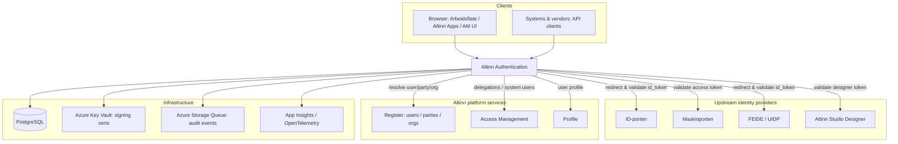
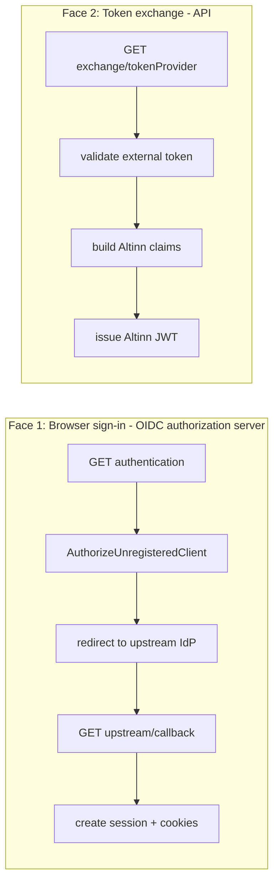

# Architecture

Altinn Authentication is an ASP.NET Core service (.NET 10) that does two distinct jobs:

1. **Authenticates** users, organisations and systems, and **issues Altinn JWTs** that the rest of the Altinn 3 platform trusts.
2. Acts as a small **OIDC authorization server** for browser sign-in (Arbeidsflate, Altinn Apps, Access Management UI), delegating the actual identity proofing to upstream providers (ID-porten, FEIDE, UIDP).

All endpoints are served under the route prefix `authentication/api/v1`.

## Context — the service and its neighbours

## Solution layout

The solution (`Altinn.Platform.Authentication.sln`) is layered:

| Project | Responsibility |
| --- | --- |
| `src/Authentication` | The web host: controllers, application services (OIDC server, token issuing, sessions, system-user), DI wiring, configuration. |
| `src/Core` | Domain models, interfaces, and pure helpers (e.g. PKCE, hashing, claim helpers). No I/O. |
| `src/Integration` | Outbound clients to other systems (Register/`PartiesClient`, Access Management, Profile, Maskinporten/OIDC providers). |
| `src/Persistance` | PostgreSQL repositories and SQL migrations (versioned directories under `Migration/`). |
| `src/jwtcookie` | `Altinn.Common.Authentication` — the shared JWT-cookie authentication handler library. |
| `test/Altinn.Platform.Authentication.Tests` | Unit + integration tests (integration tests use Testcontainers PostgreSQL — **Docker required**). |
| `test/Altinn.Platform.Authentication.SystemIntegrationTests` | Live end-to-end tests against deployed environments (opt-in). |
| `test/Altinn.Platform.Authentication.PerformanceTests` | k6/performance tests. |

**Layering rule:** dependencies point inward — `Authentication` → `Integration` → `Core`, and `Persistance` → `Core`. `Core` depends on nothing in the solution.

## Endpoint surface

All under `authentication/api/v1`. The most important controllers:

| Controller | Key endpoints | Purpose |
| --- | --- | --- |
| `AuthenticationController` | `GET authentication`, `GET refresh`, `GET exchange/{tokenProvider}` | Browser sign-in entry point; refresh the Altinn JWT; exchange an external token for an Altinn JWT. |
| `OidcFrontChannelController` | `GET authorize`, `GET upstream/callback`, `GET upstream/frontchannel-logout`, `GET openid/logout` | The OIDC authorization-server endpoints + the callback from the upstream IdP. |
| `OidcTokenController` | `POST token` | OIDC token endpoint for registered downstream clients. |
| `OpenIdController` | `GET openid/.well-known/openid-configuration`, `.../jwks` | OIDC discovery + the public signing keys (JWKS) for verifying Altinn JWTs. |
| `LogoutController` | `GET logout`, `GET logout/handleloggedout`, `GET frontchannel_logout` | Session teardown + cookie cleanup. |
| `IntrospectionController` | `POST introspection` | RFC 7662 token introspection. |
| `SelfIdentifiedAuthenticationController` | `POST link`, `POST link-request`, `POST redeem-link` | Self-identified (SI) credential validation + the account-link / "forgotten password" flow. |
| `SystemRegisterController` | `.../systemregister/...` | Registers the *systems* that can act as system users. |
| `RequestSystemUserController`, `ChangeRequestSystemUserController`, `SystemUserClientDelegationController` | `.../systemuser/...` | The system-user request / change-request / agent / delegation lifecycle. |

## The two faces of the service

The cleanest mental model is to split the service in two:

- **Face 1 (browser)** is stateful: it manages a session and sets cookies. See [flows/oidc-authorization-server.md](flows/oidc-authorization-server.md) and [flows/sessions-and-cookies.md](flows/sessions-and-cookies.md).
- **Face 2 (API)** is stateless: a caller presents a trusted external token and gets an Altinn JWT in the response body. See [flows/token-exchange.md](flows/token-exchange.md).

Beyond authentication itself, the service also owns the **system-user (Systembruker)** domain — the catalogue of registered systems, the request/approval lifecycle by which a customer grants a vendor's system access, and agent/client delegation. This is a substantial feature in its own right; see [flows/system-user.md](flows/system-user.md).

Both faces ultimately call the **token issuer** (`TokenIssuerService` / the `GenerateToken` path), which signs the Altinn JWT with a certificate selected from Key Vault. The public keys are published at the JWKS endpoint so every other Altinn service can verify the token offline.

## Key application services

| Service | Role |
| --- | --- |
| `OidcServerService` | The heart of Face 1: `/authorize`, the upstream callback + token exchange, session create/refresh/end, logout. (Large — a decomposition candidate; see [issue #2074](https://github.com/Altinn/altinn-authentication/issues/2074).) |
| `TokenService` / `TokenIssuerService` | Mint and rotate Altinn JWTs and refresh tokens. |
| `UpstreamTokenValidator` | Validates upstream `id_token`s (issuer + nonce) — the correct validation pattern for the service. |
| `PartiesClient` (Integration) | Resolves users / parties / orgs from **Register** (the canonical source — see [ADR-0003](adr/0003-register-is-canonical-for-user-and-org-lookup.md)). |
| `EventLogService` | Writes authentication audit events to an Azure Storage Queue. |
| `SystemUserService`, `SystemRegisterService`, `RequestSystemUserService` | The system-user domain. |

## Cross-cutting concerns

- **Token signing**: certificates from Azure Key Vault, selected with a rollover delay so a freshly-published cert propagates to verifiers before it signs. Public keys served at JWKS.
- **Sessions**: session handles are random 256-bit values, stored only as an HMAC-SHA256 with a server-side pepper; refresh tokens rotate with reuse-detection.
- **Audit**: authentication events are enqueued to Azure Storage Queue, gated by the `AuditLog` feature flag.
- **Observability**: OpenTelemetry tracing + metrics across all assemblies, exported to Application Insights. Structured logging via `Logging:LogLevel`.
- **Health**: `GET /health` (liveness). (Readiness/dependency checks are a known gap — see [operations.md](operations.md).)

## History worth knowing

The service used to depend on the **Altinn 2 "SBL Bridge"** backend for cookie/ticket authentication, enterprise-user auth, and user/profile lookups. Altinn 2 was shut down in 2026 and that integration was fully removed (umbrella [#2030](https://github.com/Altinn/altinn-authentication/issues/2030)). The authorization-server flow is now the **only** live browser sign-in path, and **Register** is the only source for user/party/org lookups. See [ADR-0004](adr/0004-sbl-bridge-altinn2-decommission.md) and [ADR-0002](adr/0002-authorization-server-is-the-live-auth-path.md). This matters because some remaining code (e.g. legacy SBL-cookie *deletion* on logout) is intentionally kept to drain stale cookies, even though the rest of the SBL integration is gone.
