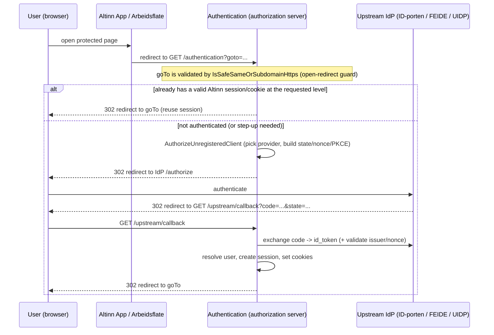

# Flow: OIDC authorization server (browser sign-in)

**Entry point:** `GET authentication/api/v1/authentication`
**Upstream callback:** `GET authentication/api/v1/upstream/callback`
**Code:** `AuthenticationController.AuthenticateUser`, `OidcFrontChannelController`, `OidcServerService`

This is the stateful, browser-facing face of the service. An unauthenticated user is redirected to an upstream identity provider (ID-porten by default, or FEIDE/UIDP), proofs their identity there, and is sent back; the service then establishes an Altinn **session**, sets cookies, and redirects the user to where they wanted to go (`goTo`).

> **Important:** this is the **only** live browser sign-in path. Production runs `EnableOidc=true`, `ForceOidc=true` and `AuthorizationServerEnabled=true`, so the legacy non-authorization-server branches have been removed. See [ADR-0002](../adr/0002-authorization-server-is-the-live-auth-path.md).

## The happy path

## Steps in detail

1. **`GET /authentication?goto=<url>`** (`AuthenticateUser`):
   - Validates `goTo` with `IsSafeSameOrSubdomainHttps` — an **open-redirect guard** that only allows an absolute `https` URL whose host equals or is a subdomain of the service host, with no embedded credentials. Anything else redirects to `BaseUrl`. *(This guard is intentional; the CodeQL "URL redirection" alerts on the subsequent redirects are dismissed false positives.)*
   - Sets `no-store`/`no-cache` headers (auth responses must never be cached).
   - If the user already has a valid session (auth cookie or Altinn session cookie) that meets the requested `acr` level, redirects straight to `goTo`.
   - Otherwise calls `OidcServerService.AuthorizeUnregisteredClient`, which selects the upstream provider (from the `iss` query param, the requested `acr`, or the configured default `idporten`), builds the upstream authorize URL (state, nonce, PKCE S256), persists an upstream login transaction, and redirects the browser to the IdP.

2. **Upstream callback** — **`GET /upstream/callback`** (`OidcFrontChannelController` → `OidcServerService.HandleUpstreamCallback`):
   - Looks up the persisted upstream transaction by `state`.
   - Exchanges the `code` for the upstream `id_token`, validates it (issuer + nonce) via `UpstreamTokenValidator`.
   - Resolves/provisions the Altinn user (from Register), creates an Altinn **session** and the cookie set, and redirects to the client / `goTo`.
   - On failure it returns a `LocalError` (e.g. `500`) rather than establishing a partial session.

3. **`acr_values` / step-up:** the entry point accepts an optional space-separated `acr_values` query parameter (allowed values validated by `AuthenticationHelper.TryParseAcrValues`). If the existing session does not meet the requested level, the user is re-authenticated upstream at the higher level.

## Registered downstream clients

Beyond the "unregistered client" browser flow above, the service is also a small OIDC provider for **registered** downstream clients (e.g. Arbeidsflate) via `GET /authorize` + `POST /token` (`OidcFrontChannelController` / `OidcTokenController`), with discovery at `GET /openid/.well-known/openid-configuration` and keys at `.../jwks`.

## acr_values

The `acrValues` parameter accepts (validated set, see `AuthenticationHelper.AllowedAcrValues`): `idporten-loa-substantial`, `idporten-loa-high`, `selfregistered-email`. The legacy `level0` / `level1` / `level2` values are still accepted but **deprecated**. Any other value yields `400 Bad Request`.

## Related

- The session + cookie mechanics, refresh, and logout: [sessions-and-cookies.md](sessions-and-cookies.md).
- The API token-exchange face: [token-exchange.md](token-exchange.md).
