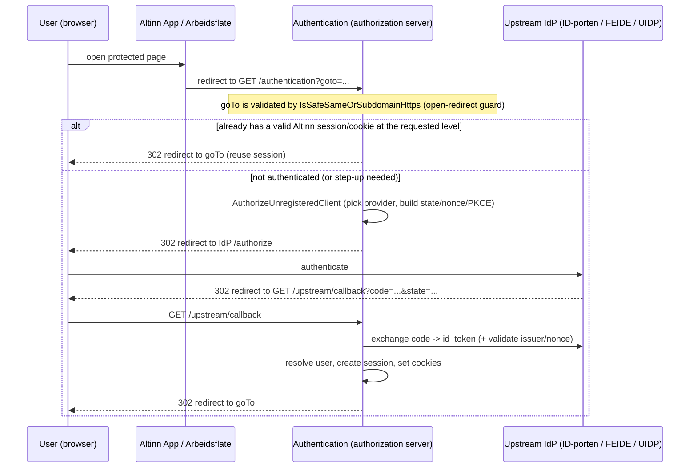

# Flow: OIDC authorization server (browser sign-in)

**Entry point:** `GET authentication/api/v1/authentication`
**Upstream callback:** `GET authentication/api/v1/upstream/callback`
**Code:** `AuthenticationController.AuthenticateUser`, `OidcFrontChannelController`, `OidcServerService`

This is the stateful, browser-facing face of the service. An unauthenticated user is redirected to an upstream identity provider (ID-porten by default, or FEIDE/UIDP), proofs their identity there, and is sent back; the service then establishes an Altinn **session**, sets cookies, and redirects the user to where they wanted to go (`goTo`).

> **Important:** this is the **only** live browser sign-in path. Production runs `EnableOidc=true`, `ForceOidc=true` and `AuthorizationServerEnabled=true`, so the legacy non-authorization-server branches have been removed. See [ADR-0002](../adr/0002-authorization-server-is-the-live-auth-path.md).

## The happy path

```mermaid
sequenceDiagram
    participant U as User (browser)
    participant App as Altinn App / Arbeidsflate
    participant Auth as Authentication (authorization server)
    participant IdP as Upstream IdP (ID-porten / FEIDE / UIDP)

    U->>App: open protected page
    App->>Auth: redirect to GET /authentication?goto=...
    Note over Auth: goTo is validated by IsSafeSameOrSubdomainHttps (open-redirect guard)
    alt already has a valid Altinn session/cookie at the requested level
        Auth-->>U: 302 redirect to goTo (reuse session)
    else not authenticated (or step-up needed)
        Auth->>Auth: AuthorizeUnregisteredClient (pick provider, build state/nonce/PKCE)
        Auth-->>U: 302 redirect to IdP /authorize
        U->>IdP: authenticate
        IdP-->>U: 302 redirect to GET /upstream/callback?code=...&state=...
        U->>Auth: GET /upstream/callback
        Auth->>IdP: exchange code -> id_token (+ validate issuer/nonce)
        Auth->>Auth: resolve user, create session, set cookies
        Auth-->>U: 302 redirect to goTo
    end
```

## Steps in detail

1. **`GET /authentication?goto=<url>`** (`AuthenticateUser`):
   - Validates `goTo` with `IsSafeSameOrSubdomainHttps` — an **open-redirect guard** that only allows an absolute `https` URL whose host equals or is a subdomain of the service host, with no embedded credentials. Anything else redirects to `BaseUrl`. *(This guard is intentional; the CodeQL "URL redirection" alerts on the subsequent redirects are dismissed false positives.)*
   - Sets `no-store`/`no-cache` headers (auth responses must never be cached).
   - If the user already has a valid session (auth cookie or Altinn session cookie) that meets the requested `acr` level, redirects straight to `goTo`.
   - Otherwise calls `OidcServerService.AuthorizeUnregisteredClient`, which selects the upstream provider (from the `iss` query param, the requested `acr`, or the configured default `idporten`), builds the upstream authorize URL (state, nonce, PKCE S256), persists an upstream login transaction, and redirects the browser to the IdP.

2. **Upstream callback** — **`GET /upstream/callback`** (`OidcFrontChannelController` → `OidcServerService.HandleUpstreamCallback`):
   - Looks up the persisted upstream transaction by `state`.
   - Exchanges the `code` for the upstream `id_token`, validates it (issuer + nonce) via `UpstreamTokenValidator`.
   - Resolves/provisions the Altinn user (from Register), creates an Altinn **session** and the cookie set, and redirects to the client / `goTo`.
   - If the upstream token exchange fails (refused, unreachable, or a body that is not a token response) or the returned tokens do not validate, sign-in stops **fail-closed**: no session is created, and the user is sent back to the downstream client with `error=temporarily_unavailable`. Where there is no validated `redirect_uri` to return to — the unregistered-client (`goto`) flow — it is a local `502` instead, because bouncing back to the `goto` URL without a session would start another login attempt. Both causes are counted on `altinn.authentication.oidc.upstream_token_exchange` / `…upstream_token_validation` (see [operations.md](../operations.md#custom-metrics)).
   - Other failures return a `LocalError` (e.g. `500`) rather than establishing a partial session.

3. **`acr_values` / step-up:** the entry point accepts an optional space-separated `acr_values` query parameter (allowed values validated by `AuthenticationHelper.TryParseAcrValues`). If the existing session does not meet the requested level, the user is re-authenticated upstream at the higher level.

## Registered downstream clients

Beyond the "unregistered client" browser flow above, the service is also a small OIDC provider for **registered** downstream clients (e.g. Arbeidsflate) via `GET /authorize` + `POST /token` (`OidcFrontChannelController` / `OidcTokenController`), with discovery at `GET /openid/.well-known/openid-configuration` and keys at `.../jwks`.

## acr_values

The accepted set is **derived from the configured ID-providers** rather than hardcoded: it is the union of every `AuthLevels[].Acr` declared under `OidcProviders`, plus ID-porten's built-in vocabulary. See `IAcrValueCatalog` / `OidcAcrValueCatalog`. Any other value yields `400 Bad Request`.

With ID-porten alone that set is `idporten-loa-substantial`, `idporten-loa-high` and `selfregistered-email`; the legacy `level0` / `level1` / `level2` values are still accepted but **deprecated**.

These acr values are **Altinn-facing**. They are what a client requests, what is stored on the session, and what is emitted in the `acr` claim — deliberately not the upstream provider's vocabulary. Each configured level carries its own `UpstreamAcrValues`, which is what gets sent to that provider's authorize endpoint, so one provider's vocabulary is never forwarded to another.

### Client authentication: client secret or private_key_jwt

By default Altinn authenticates to a provider's token endpoint with `ClientSecret`. Some providers do not accept that at all — HelseID's security profile permits **no** mechanism other than `private_key_jwt`, so a client secret there is refused with `invalid_client` regardless of how the provider is otherwise configured.

Setting `ClientAssertionPrivateKeyPem` switches that provider to a signed client assertion (RFC 7523). It takes precedence over `ClientSecret`, which is why a provider that has both configured still sends only the assertion.

| Setting | Purpose |
|---|---|
| `ClientAssertionPrivateKeyJwk` | Private RSA JWK, verbatim or base64-encoded. **Preferred** when the provider issues a JWK. |
| `ClientAssertionPrivateKeyPem` | Private key as PEM, PKCS#8 or PKCS#1. For providers that issue that format instead. |
| `ClientAssertionKeyId` | `kid` header. Read from the JWK when one is configured; set this only to override. |
| `ClientAssertionAlgorithm` | Resolved as: this setting, then the JWK's `alg`, then `PS256`. Only asymmetric RSA algorithms are accepted. |
| `ClientAssertionAudience` | Defaults to `Issuer`. |

Exactly one of the two key settings may be set; configuring both throws rather than picking one.

Prefer the JWK when the provider hands one out, as HelseID does at client registration. It carries its own `kid` and `alg`, so those need not be configured alongside it — two settings that would otherwise duplicate the key material and could drift out of step with it.

The JWK is accepted both verbatim and base64-encoded; the two are told apart by whether the value begins with `{`. Base64 exists because a bare JSON object in a YAML `value:` is parsed as a flow mapping rather than a string unless quoted, which is a trap that does not fail loudly. It is an encoding convenience, not a protection — base64 is not encryption, and encoding the key only makes it harder to see which `kid` is deployed.

The assertion carries `iss` and `sub` set to the client id, a single-use `jti`, and a lifetime of ten seconds — HelseID rejects anything longer. Its `typ` header is `client-authentication+jwt` so it cannot be replayed as another kind of token.

The audience is the provider's **issuer identifier, not its token endpoint**. That distinction matters: several providers accepted the endpoint URL historically, and NHN documents explicitly that it must not be used. Override it only when a provider asks for something other than its issuer.

The key is a secret and belongs wherever the deployment keeps secrets, alongside the client secrets it replaces. A misconfigured or unreadable key throws on the first sign-in with the provider named, rather than producing an `invalid_client` from upstream that says nothing about the cause.

### Pushed Authorization Requests, DPoP and strict validation

Providers following a FAPI 2.0-style profile require more than a client assertion. HelseID requires all of the following, and refuses a sign-in that omits any of them. Each is opt-in per provider, so ID-porten and UIDP are unaffected.

| Setting | Requirement |
|---|---|
| `PushedAuthorizationRequestEndpoint` | Push the authorization parameters back-channel (RFC 9126) and redirect with only `client_id` and `request_uri`. |
| `UseDpop` | Send a DPoP proof (RFC 9449) with the token request, signed with the client-assertion key. |
| `StrictIdTokenValidation` | For id_tokens only: require `aud` to contain our `client_id`, and the issuer to match exactly. Never applied to access tokens. |
| `TreatAccessTokenAsOpaque` | Do not read or validate the access token. |
| `ValidateCallbackIssuer` | Require and validate the callback's `iss` (RFC 9207). |

**PAR has no front-channel fallback.** A failed push aborts the sign-in. A provider that requires PAR would refuse the front-channel request anyway, and sending parameters through the browser after failing to push them would defeat the reason for pushing them. The unregistered-client flow stops locally rather than redirecting, so a failure cannot become a sign-in loop.

**DPoP nonces are remembered per provider.** RFC 9449 §8.2 makes it a MUST: a nonce the provider supplies on a successful response is used on the next token request, and every one after it, until the provider supplies a new one. `IDpopNonceStore` (a singleton — the provider service is a typed `HttpClient` and therefore transient) keeps the most recent nonce per provider key and sends it up front. A nonce is accepted only by the server that issued it (§9), so the store is keyed by provider and never mixes them.

A provider may still reject a request with `use_dpop_nonce` and a `DPoP-Nonce` header — the first request after a restart, or when it rotates its nonce. One retry with a fresh proof and a fresh client assertion (both `jti` values are single-use) is part of the normal flow, and whatever nonce the retry's response carries is remembered too. The retry is bounded at one. In steady state the `upstream_dpop_nonce_challenge` counter should read close to zero; a sustained rate means the provider is rotating faster than we track, or something is wrong.

**The access token is the API's, not ours.** HelseID states the client must not inspect or validate it. It happens to be a JWT today, which is exactly why depending on that is fragile — a DPoP-bound or reformatted token would break a client that parses it. With `TreatAccessTokenAsOpaque` the granted scopes come from the token response's `scope` field instead, which is the authoritative statement of what was granted and is readable either way.

**Strict validation is opt-in for a reason.** The shared validator has always skipped audience entirely and treated a trailing slash on the issuer as equivalent. Requiring both globally could start rejecting tokens from providers that rely on the leniency, so each provider adopts it deliberately. `StrictIdTokenValidation` turns off the trailing-slash allowance as well: a profile that asks for exact issuer matching gets exactly that.

"Exact" is enforced against IdentityModel's own defaults: it ignores a trailing slash when comparing audiences unless told not to, so `<client_id>/` would otherwise pass as our client id. Strict validation turns that off.

It is an **id_token** rule, and applies to every id_token — including one presented as `id_token_hint` at end-session — but never to an access token, whose audience is the API rather than us. The caller states which kind it is validating; it is not inferred from whether a nonce was supplied, because an `id_token_hint` carries none and was once validated as if it were an access token.

**Discovery is the authority for the callback issuer.** With `ValidateCallbackIssuer`, the callback's `iss` is compared against the issuer the provider asserts in its discovery document, which must itself match configuration. Unreachable discovery, a document with no issuer, or a disagreement between document and configuration all refuse the callback.

**Callback `iss` never selects the provider.** The provider comes from the login transaction looked up by `state`; the parameter is only checked against it. Letting it choose would defeat the purpose. The check runs before the code is exchanged and before any session is touched, and applies to error responses too — a mix-up can replay an error just as well as a code.

### Providers outside ID-porten's conventions

A provider whose token does not follow ID-porten's claim names or values is described in configuration, not in code:

| Setting | Purpose |
|---|---|
| `ClaimMappings` | Which claim carries pid / level / method / email. Defaults to `pid`, `acr`, `amr`, `email`. |
| `AuthLevels` | The levels the provider offers: Altinn-facing `Acr`, normalised `Level`, `UpstreamAcrValues` to request it, and the `ClaimValues` that come back for it. |
| `AuthMethodMappings` | Provider method-claim values to Altinn's `AuthenticationMethod`. Unmatched values fall back to `DefaultAuthenticationMethod`; when that resolves to `NotDefined` the method claim is omitted rather than guessed. |
| `DefaultUpstreamAcrValues` | What to send when the client requested **no** level at all. Omit it to let the provider apply its own default. |

Declaring `AuthLevels` is what makes a provider reachable via `acr_values`; providers without it do not take part in acr routing and are selected by the `iss` parameter instead.

A level whose `UpstreamAcrValues` is omitted deliberately sends **nothing** upstream, and this is distinct from the client requesting nothing: `DefaultUpstreamAcrValues` applies only in the latter case. HelseID needs both — it documents a filter for high (`Level4`, or its synonym `High`) but none for substantial — so `helseid-loa-substantial` must send no filter rather than fall back to the default, which would narrow the request the client actually made.

For the same reason, do not set `DefaultUpstreamAcrValues` unless there is a decision behind it. Sending a level filter when the client asked for nothing overrides the provider's own default and narrows its identity-provider picker on the client's behalf — for HelseID, `Level4` would exclude Helse Midt-Norge, Helseplattformen and MinID users entirely. The level requirement belongs with the application that knows its data, expressed as an explicit `acr_values`.

Step-up compares **normalised levels**, not acr strings (`AuthenticationHelper.NeedAcrUpgrade`), so a session from one provider can satisfy a level requested in another's vocabulary. A session whose acr resolves to no level does not satisfy a request above level 0.

Acr values declared by a provider must be unique across the whole configuration, and only `idporten` may declare ID-porten's built-in values. Violations fail at startup rather than being resolved by configuration order, which would silently route existing clients to a different ID-provider.

### A federating provider can hide the actual method

HelseID offers BankID twice: directly (`idp:bankid-oidc`) and through ID-porten (`idp:idporten-oidc` with `amr:bankid`). Only the first tells us which eID was used. Via ID-porten the `idp` claim says `idporten-oidc`, and the eID behind it — BankID, Buypass, Commfides or MinID — is not visible to us. NHN documents neither what the `idp` claim contains for each route nor whether ID-porten's own `amr` is passed through; HelseID's own `amr` is the Duende default `["pwd"]`.

So `idporten-oidc` is deliberately **not** mapped in `AuthMethodMappings`. Mapping it to any single method would assert something we cannot know, and mislabel a MinID user as BankID. It falls through to `DefaultAuthenticationMethod`, and the method claim is omitted.

The level is unaffected: `security_level` is authoritative on both routes. Direct BankID is always 4; via ID-porten it is 3 or 4.

### Testing against HelseID

Use HelseID's Test IdP (`acr_values=idp:testidp-oidc`), which NHN recommends over the other providers in their test environment and which exists **only** there.

Its `security_level` is not documented. If it returns a value outside the configured `ClaimValues`, the level resolves to `SelfIdentifed` (0) — which looks like a broken mapping but is an unmapped value. The raw claim value is preserved verbatim in the session's `acr` column precisely so this is diagnosable: one sign-in shows what Test IdP actually sends, and the value can then be added to the right `AuthLevels` entry. Its `idp` value (`testidp-oidc`) is likewise unmapped, so no method claim is emitted.

HelseID test users carry Tenor synthetic identity numbers (month 81–92). A test-environment HelseID provider should therefore also set `RequireSyntheticPid: true`, which fails the sign-in closed if anything but a synthetic pid arrives.

### Trust equivalence between providers — open policy question

Comparing normalised levels means **equal numeric levels from different providers are treated as interchangeable**. A `helseid-loa-high` session (level 4) satisfies a request for `idporten-loa-high` (level 4) without a step-up.

This is a deliberate consequence of normalising, and it is what makes step-up work at all for a provider that does not emit `acr` — but it is a *trust* decision, not a technical one, and it has **not been ratified**. It deserves scrutiny because HelseID federates onward: a HelseID level-4 session may be an ID-porten BankID authentication underneath, or it may come from a regional health IdP such as Helse Midt-Norge or Helseplattformen. Whether those are equivalent for an Altinn client that asked specifically for ID-porten level 4 is a question for the auth team and, plausibly, for legal.

Until that is settled, treat cross-provider level equivalence as unratified. See [#2163](https://github.com/Altinn/altinn-authentication/issues/2163).

### Not yet enforced: the level actually achieved

The requested `acr_values` are used to pick the provider, to build the upstream request, and to decide whether an *existing* session needs a step-up. They are persisted on the login transaction, but **nothing compares them against the level actually achieved once the user returns from the upstream provider.** A client can request level 4, be authenticated at level 0, and receive a session with no error. This predates configurable providers and applies to every provider.

## Related

- The session + cookie mechanics, refresh, and logout: [sessions-and-cookies.md](sessions-and-cookies.md).
- The API token-exchange face: [token-exchange.md](token-exchange.md).
