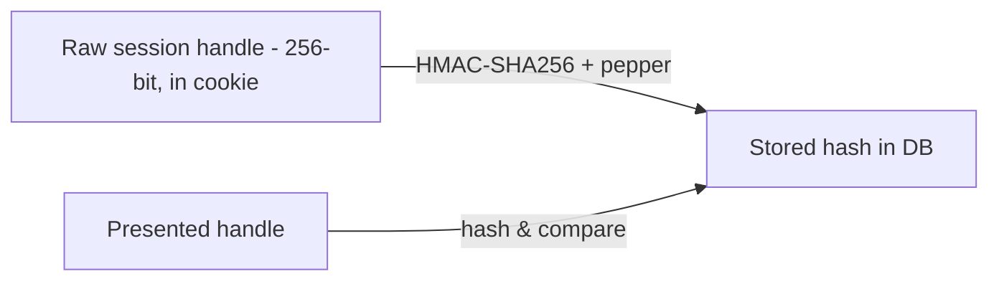
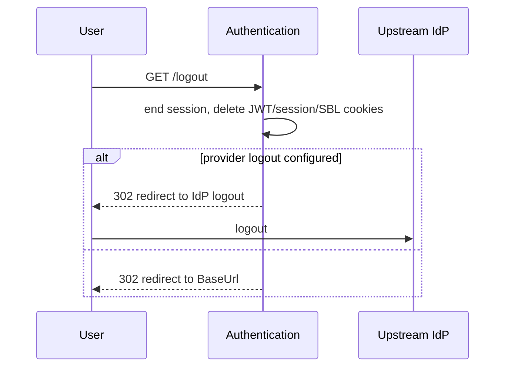

# Flow: Sessions, cookies, refresh & logout

The browser sign-in flow ([oidc-authorization-server.md](oidc-authorization-server.md)) establishes an Altinn **session** and a set of **cookies**. This page describes that state, how the JWT is refreshed, and how logout tears it down.

## Cookies

| Cookie (setting) | Purpose |
| --- | --- |
| `JwtCookieName` (default `AltinnStudioRuntime`) | Holds the Altinn JWT used by Altinn Apps / the runtime. |
| `AltinnSessionCookieName` (default `altinnsession`) | The Altinn session handle; lets the service re-issue a JWT without a full upstream round-trip. |
| `AltinnPartyCookieName` / `AltinnPartyUuidCookieName` | The currently-selected party (reportee). |
| `AltinnLogoutInfoCookieName` | Carries post-logout redirect info. |
| `OidcNonceCookieName`, `AuthnGoToCookieName` | Transient state for the OIDC round-trip (nonce, original `goTo`). |
| `SblAuthCookieName` / `SblAuthCookieEnvSpecificName` (`.ASPXAUTH`) | **Legacy Altinn 2 cookie.** No longer *issued*. It is still *deleted* on logout/session creation to drain stale cookies left over from Altinn 2. See [ADR-0004](../adr/0004-sbl-bridge-altinn2-decommission.md) — do not remove this cleanup yet. |

All first-party cookies are set `HttpOnly` + `Secure`.

## Sessions

- A **session handle** is a random 256-bit (CSPRNG) value handed to the browser in the session cookie.
- The server never stores the raw handle — it stores an **HMAC-SHA256** of the handle with a server-side **pepper** (`GeneralSettings.OidcRefreshTokenPepper`). A presented handle is hashed and compared.
- **Refresh tokens** are rotated on use, with reuse-detection across a token "family"; stored hashed (PBKDF2, opportunistically migrated to HMAC).

## Refresh

**Endpoint:** `GET authentication/api/v1/refresh` (`AuthenticationController.RefreshJwtCookie`)

Re-issues an Altinn JWT for an already-authenticated principal (e.g. when the JWT has expired but the session is still valid). `enrichPid=true` will additionally look up the party and inject the `pid` (SSN) claim.

> Note: gating of `enrichPid` is flagged for review in [issue #2074](https://github.com/Altinn/altinn-authentication/issues/2074) (it injects PII based on a self-asserted flag).

## Logout

**Endpoints:** `GET logout`, `GET logout/handleloggedout`, `GET frontchannel_logout` (`LogoutController`), and `GET openid/logout` / `GET upstream/frontchannel-logout` (`OidcFrontChannelController`).

- `GET logout` ends the Altinn session, clears the Altinn cookies **and the legacy SBL cookies**, and redirects (to the upstream provider's logout, or to `BaseUrl`).
- Front-channel logout endpoints support upstream-initiated single logout.

