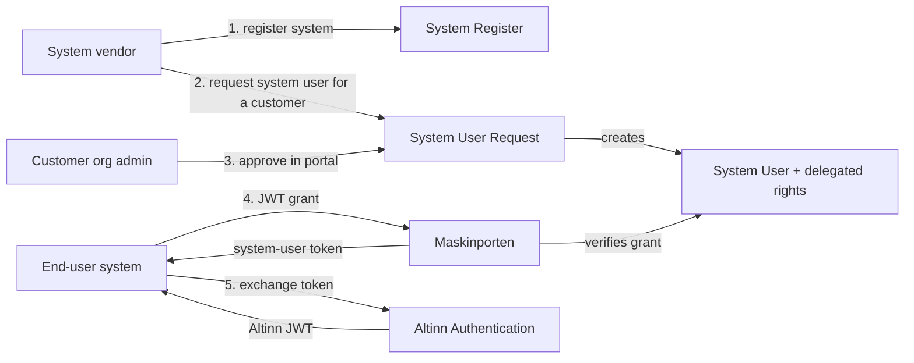
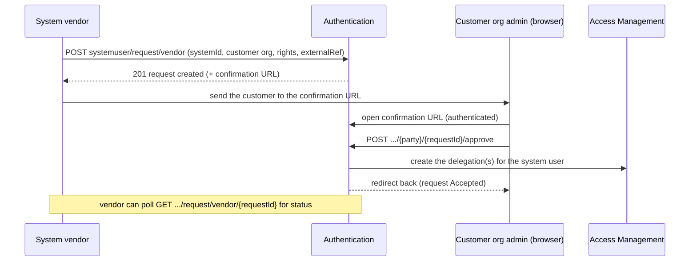

# Flow: System user (Systembruker)

**Concept docs:** [System User — Altinn](https://docs.altinn.studio/authentication/what-do-you-get/systemuser/) · [System user guide](https://docs.altinn.studio/en/authorization/guides/system-vendor/system-user/) · [System authentication for system providers](https://docs.altinn.studio/authentication/guides/systemauthentication-for-systemproviders/)

**Controllers:** `SystemRegisterController`, `RequestSystemUserController`, `ChangeRequestSystemUserController`, `SystemUserController`, `SystemUserClientDelegationController`
**Services:** `SystemRegisterService`, `RequestSystemUserService`, `ChangeRequestSystemUserService`, `SystemUserService`

## What it is

A **system user** (Norwegian *systembruker*) lets an **end-user system** — e.g. an accounting or payroll product built by a **system vendor** — act on behalf of a **customer organisation** towards Altinn and other public-sector APIs, with fine-grained authorization and **without exchanging certificates/passwords per customer**. It is the Altinn 3 replacement for the Altinn 2 *enterprise user* (`virksomhetsbruker`), which this service now rejects with `410 Gone` (see [ADR-0004](../adr/0004-sbl-bridge-altinn2-decommission.md)).

**Maskinporten is central** to the runtime: the end-user system authenticates to Maskinporten with a JWT grant identifying the customer and the system; Maskinporten verifies *with Altinn* that the customer has granted that system access, and issues a **system-user token**. This authentication component owns the **Altinn side** of that picture — the system catalogue, the request/approval lifecycle, and the delegations that Maskinporten checks against — and it exchanges the resulting Maskinporten token for an Altinn JWT (see [token-exchange.md](token-exchange.md), `maskinporten` path).

## This service's responsibilities

| Area | Controller (route under `authentication/api/v1`) | What it does |
| --- | --- | --- |
| **System register** | `systemregister` | The catalogue of *registered systems* a vendor offers — system id, the rights and access packages a system needs, change log. CRUD for vendors + read for everyone. |
| **System user request** | `systemuser/request` | A vendor requests that a specific customer org set up a (standard or **agent**) system user; the customer's authorised person approves/rejects it; on approval the system user + its delegated rights are created. |
| **Change request** | `systemuser/changerequest` | Request a change to the rights of an existing system user (same approve/reject lifecycle). |
| **System user management** | `systemuser`, `enduser/systemuser` | List / get / delete system users for a party; vendor lookups (by system, by query, by external id); an internal change stream; and agent-system-user **client delegation** management. |

## The request → approval lifecycle

The core flow is a vendor-initiated request that a customer must approve. Both **standard** and **agent** variants exist (`.../request/vendor` and `.../request/vendor/agent`).

- **Idempotency / dedup:** a request is keyed by `ExternalRequestId(OrgNo, ExternalRef, SystemId)` — re-posting the same triple returns the existing request rather than creating a duplicate.
- **Status:** a request moves from a pending state to `Accepted` / `Rejected` (see `RequestStatus`). The vendor reads status via the `vendor/...` GET endpoints; the customer approves/rejects via the `{party}/{requestId}/approve|reject` endpoints.
- **Confirmation URL:** built from the host + request id (with the `DONTCHOOSEREPORTEE` parameter for the portal), this is where the customer is sent to approve. The portal redirects through to the Access Management UI.

## Agent system users & client delegation

An **agent** system user acts on behalf of **multiple clients** — the classic case being an accountant/auditor firm whose system manages many customers. Beyond the standard flow:

- `systemuser/request/vendor/agent` creates an *agent* request.
- `enduser/systemuser` + the `systemuser/agent/...` endpoints manage **client delegations** — which clients (customers) a given agent system user may act for, plus the agent's own ("self") delegations and the customer list. See `SystemUserClientDelegationController` and the `agent/...` routes in `SystemUserController`.

## Where to look in code

- **Models:** `src/Core/Models/SystemUsers/` (e.g. `CreateRequestSystemUser`, `CreateAgentRequestSystemUser`, `RequestStatus`, `ExternalRequestId`, `AgentDelegation*`, `ClientDto`) and `src/Core/Models/SystemRegisters/`.
- **Services:** `SystemUserService` (large — a decomposition candidate, see [#2074](https://github.com/Altinn/altinn-authentication/issues/2074)), `SystemRegisterService`, `RequestSystemUserService`, `ChangeRequestSystemUserService`.
- **Persistence:** repositories + migrations under `src/Persistance` (the `systemuserprofile` / system-register tables).

## Related

- The Maskinporten token that a system user ultimately presents is exchanged for an Altinn JWT in [token-exchange.md](token-exchange.md).
- Why enterprise users were removed in favour of system users: [ADR-0004](../adr/0004-sbl-bridge-altinn2-decommission.md).
- Authoritative concept + onboarding docs: [docs.altinn.studio — System User](https://docs.altinn.studio/authentication/what-do-you-get/systemuser/).
