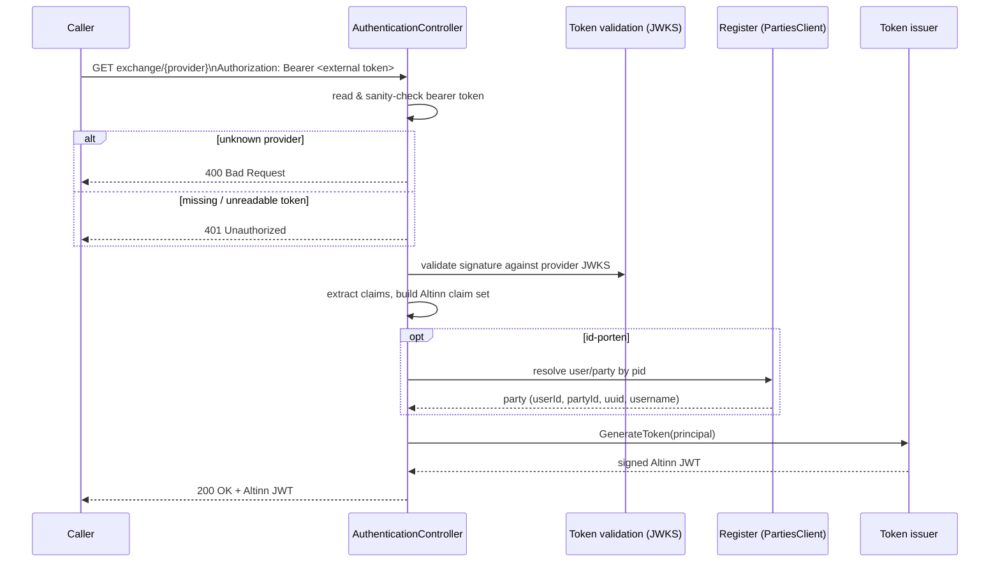

# Flow: Token exchange

**Endpoint:** `GET authentication/api/v1/exchange/{tokenProvider}`
**Code:** `AuthenticationController.ExchangeExternalSystemToken` → `AuthenticateIdPortenToken` / `AuthenticateMaskinportenToken` / `AuthenticateAltinnStudioToken`

A caller that already holds a token from a **trusted external provider** presents it as a `Bearer` token in the `Authorization` header and receives a freshly-minted **Altinn JWT** in the response body. This is the stateless, API-facing face of the service — no cookies, no session.

`{tokenProvider}` is one of (case-insensitive): `id-porten`, `maskinporten`, `altinnstudio`.

## Per-provider specifics

### `id-porten`
End-user (person) login exchange.
1. Validate the ID-porten token signature (primary JWKS, falling back to the alternative well-known endpoint).
2. Require an Altinn or partner scope, and a `pid` + `acr`.
3. Resolve the user from **Register** (`PartiesClient.GetPartyIdentifiersAndUsernameByPersonIdentifier(pid)`) → `userId`, `userName`, `partyId`, `partyUuid`. See [ADR-0003](../adr/0003-register-is-canonical-for-user-and-org-lookup.md).
4. Map `acr` → Altinn authentication level, build the claim set, and issue the Altinn JWT.

### `maskinporten`
System/organisation login exchange.
1. Validate the Maskinporten token (primary + alternative signing keys) and the issuer.
2. Read the organisation number from the `consumer` claim (ISO 6523).
3. If the token carries the `altinn:serviceowner` scope, look up the org and add the `urn:altinn:org` claim.
4. **Enterprise users (`virksomhetsbruker`) are no longer supported** — a request with the `X-Altinn-EnterpriseUser-Authentication` header is rejected with `410 Gone` (see [ADR-0004](../adr/0004-sbl-bridge-altinn2-decommission.md)).
5. Build the org claim set and issue the Altinn JWT.

### `altinnstudio`
Altinn Studio Designer login exchange.
1. Require issuer `studio` / `dev-studio` / `staging-studio`.
2. Validate the signature against the designer signing keys.
3. Copy the original claims and issue an Altinn JWT.

## Responses

| Status | When |
| --- | --- |
| `200 OK` | Token valid; body contains the Altinn JWT. |
| `400 Bad Request` | Unknown `{tokenProvider}`. |
| `401 Unauthorized` | Missing/unreadable/invalid token, missing required claims, or (currently) any downstream failure caught by the catch-all. |
| `403 Forbidden` | id-porten token without a required Altinn/partner scope. |
| `410 Gone` | Maskinporten request asking for enterprise-user authentication. |
| `429 Too Many Requests` | A self-identified account is locked out. |

## Verification & known issues

Token validation here is security-critical. Several aspects are flagged for review in [issue #2074](https://github.com/Altinn/altinn-authentication/issues/2074):

- The shared validation disables `ValidateIssuer`/`ValidateAudience` and uses a **substring** issuer check; the id-porten path has no issuer check. **Verify intent before changing** — the OIDC-server side (`UpstreamTokenValidator`) does the stricter, correct validation and is the pattern to follow.
- A Register **outage** is currently mapped to `401` rather than `5xx` (see [#2072](https://github.com/Altinn/altinn-authentication/issues/2072)).
- `IsValidIssuer` is **misnamed** (returns `true` for an *invalid* issuer) but its control flow is correct — do not "fix" the control flow.

> The companion browser-sign-in path is in [oidc-authorization-server.md](oidc-authorization-server.md); how the issued token lives in cookies/sessions is in [sessions-and-cookies.md](sessions-and-cookies.md).
